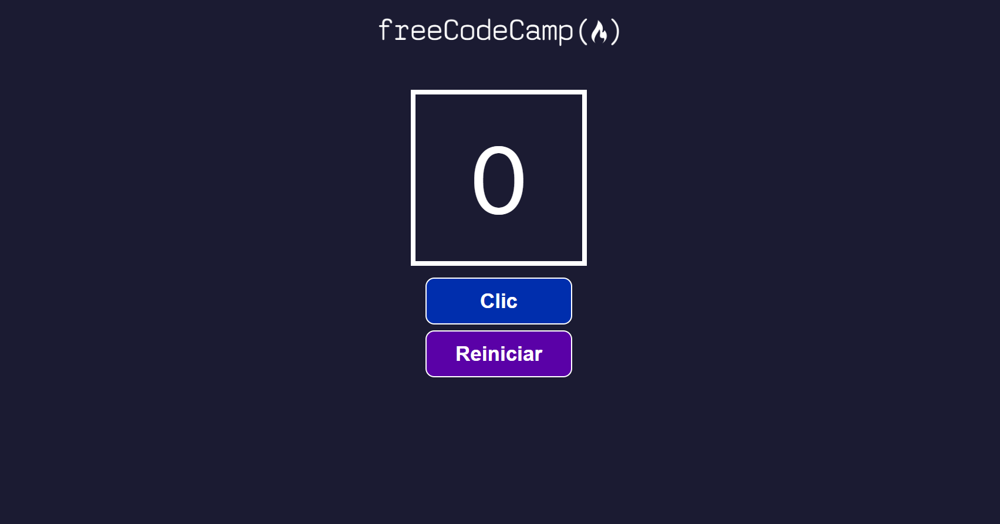

# Proyecto #2 React - Contador de clics - freeCodeCamp.org 

Este proyecto fue realizado con  [Create React App](https://github.com/facebook/create-react-app), como práctica para el aprendizaje de esta biblioteca en freeCodeCamp.org.

## Descripción del proyecto
Aplicación para contar la cantidad de clics que se realizan al presionar un botón, la aplicación consta de tres componentes, un componente contador (componente 1), muestra la cantidad de clics que se han hecho sobre un botón (componente 2), y un segundo botón (componente 3) para inicializar el contador desde cero. 

[freeCodeCamp.org](https://www.freecodecamp.org/fcc0dc40656-86b6-4bd7-a2b0-5ccd1ae5cc31).

## Temas de estudio:
* Estructura de un proyecto en React.
* Componentes.
* Importar y exportar componentes.
* Propiedades: props.
* Destructuración.
* Hooks: Estados (useState).

## Acerca del autor:
* [LinkedIn](https://www.linkedin.com/in/carlos-munera-259969262 "Linkedin")